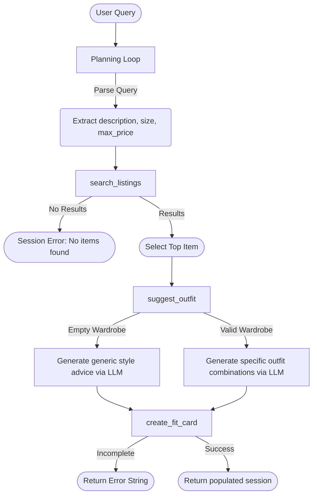

# FitFindr — planning.md

> Complete this document before writing any implementation code.
> Your spec and agent diagram are what you'll use to direct AI tools (Claude, Copilot, etc.) to generate your implementation — the more specific they are, the more useful the generated code will be.
> Your planning.md will be reviewed as part of your submission.
> Update it before starting any stretch features.

---

## Tools

### Tool 1: search_listings

**What it does:**
Searches the provided mock listings dataset for secondhand items that match the user's description, size, and maximum price. It scores listings by keyword overlap and returns them sorted by relevance.

**Input parameters:**
- `description` (str): Keywords describing the desired item (e.g., "vintage graphic tee").
- `size` (str | None): Optional size filter (case-insensitive).
- `max_price` (float | None): Optional maximum price threshold (inclusive).

**What it returns:**
A list of dictionaries representing matching listings. Each dictionary contains fields like `id`, `title`, `description`, `price`, `size`, `brand`, etc.

**What happens if it fails or returns nothing:**
If no matches are found, it returns an empty list `[]` without raising an exception. The agent planning loop detects this and informs the user to try different keywords or loosen constraints.

---

### Tool 2: suggest_outfit

**What it does:**
Generates a complete outfit suggestion using the newly found thrifted item and the user's existing wardrobe by prompting the Groq LLM (llama-3.3-70b-versatile).

**Input parameters:**
- `new_item` (dict): The selected listing dictionary from `search_listings`.
- `wardrobe` (dict): A dictionary representing the user's wardrobe, which contains a list of items under the 'items' key.

**What it returns:**
A string containing a conversational outfit suggestion.

**What happens if it fails or returns nothing:**
If the wardrobe is empty, the LLM is prompted to provide general, versatile styling advice for the `new_item` instead of failing. If the API fails, an error is caught and passed up.

---

### Tool 3: create_fit_card

**What it does:**
Takes the outfit suggestion and the new item details to generate a short, catchy, Instagram-style caption utilizing the Groq LLM.

**Input parameters:**
- `outfit` (str): The text suggestion generated by `suggest_outfit`.
- `new_item` (dict): The selected listing dictionary.

**What it returns:**
A short string (2-4 sentences) acting as a shareable outfit caption.

**What happens if it fails or returns nothing:**
If the `outfit` string is missing or entirely whitespace, the tool detects this immediately and returns a descriptive error message string, rather than causing an exception or a hallucinated LLM response.

---

### Optional Stretch Tool: retry_search_with_fallback

**What it does:**
If the first search returns no results, this tool retries the search with loosened constraints (e.g. removing size/price filters, and generalizing the description).

**Input parameters:**
- `original_description` (str): the original search phrase
- `size` (str | None): the original size filter
- `max_price` (float | None): the original price ceiling

**What it returns:**
A list of dicts containing the fallback results.

**What happens if it fails or returns nothing:**
If the fallback search also fails, it returns an empty list, and the agent must tell the user that even with looser constraints, no items were found.

---

## Planning Loop

**How does your agent decide which tool to call next?**
1. The agent starts by parsing the natural language query into a structured set of arguments (description, size, max_price).
2. It calls `search_listings` with the parsed parameters.
3. If `search_listings` returns an empty list, it calls `retry_search_with_fallback` to try a looser search.
4. If `retry_search_with_fallback` also returns an empty list, the agent sets `session["error"] = "No matching items found"` and returns.
5. If results exist (from either search), it takes the top result (index 0) and sets it to `session["selected_item"]`. If fallback was used, it sets `session["fallback_message"]`.
6. It then sequentially calls `suggest_outfit`, feeding the `selected_item` and the `wardrobe` dict.
7. Once `suggest_outfit` returns a string, it stores it in `session["outfit_suggestion"]`.
8. Finally, it passes the suggestion and `selected_item` to `create_fit_card` and stores the resulting caption in `session["fit_card"]`, completing the run.

---

## State Management

**How does information from one tool get passed to the next?**
Information is passed through a central `session` dictionary initialized at the start. 
- The query parsing step writes to `session["parsed"]`.
- `search_listings` writes to `session["search_results"]`. 
- The first item in results is extracted and saved directly to `session["selected_item"]`.
- The `selected_item` is injected directly as a parameter to the subsequent tools `suggest_outfit` and `create_fit_card`.
- The output of `suggest_outfit` is stored in `session["outfit_suggestion"]`, and later passed to `create_fit_card`.

---

## Error Handling

For each tool, describe the specific failure mode you're handling and what the agent does in response.

| Tool | Failure mode | Agent response |
|------|-------------|----------------|
| search_listings | No results match the query | Agent catches the empty list, skips subsequent tools, and returns a helpful message explaining that no items were found. |
| suggest_outfit | Wardrobe is empty | The tool itself detects the empty list and prompts the LLM to output general style advice instead of combining it with missing pieces. |
| create_fit_card | Outfit input is missing or incomplete | The tool intercepts the empty string before calling the LLM and returns an explicit error string indicating that caption generation failed. |

---

## Architecture

---

## AI Tool Plan

**Milestone 3 — Individual tool implementations:**
- **AI Tool**: Antigravity (Gemini)
- **Input**: Tool definitions from this file (what it does, inputs, returns, error handling).
- **Expectation**: Python functions `search_listings`, `suggest_outfit`, and `create_fit_card` in `tools.py` that handle all branching paths properly, along with unit tests.
- **Verification**: Will write Pytest unit tests in `tests/test_tools.py` covering successful paths, empty results, empty wardrobes, and empty outfit inputs.

**Milestone 4 — Planning loop and state management:**
- **AI Tool**: Antigravity (Gemini)
- **Input**: The Mermaid architecture diagram and planning loop text.
- **Expectation**: An implemented `run_agent()` function in `agent.py`.
- **Verification**: Running `agent.py` standalone to verify the output for the happy path and no-results path print appropriately without exceptions.

---

## A Complete Interaction (Step by Step)

**Example user query:** "I'm looking for a vintage graphic tee under $30. I mostly wear baggy jeans and chunky sneakers. What's out there and how would I style it?"

**Step 1:**
The agent parses the query: `description="vintage graphic tee"`, `max_price=30.0`. It calls `search_listings("vintage graphic tee", None, 30.0)`.

**Step 2:**
`search_listings` returns a list of matching items. The agent selects the top result, an item titled "Faded Band Tee — $22". The agent then calls `suggest_outfit(selected_item, wardrobe)`.

**Step 3:**
`suggest_outfit` calls the LLM with the item and wardrobe. It returns: "Pair this Faded Band Tee with your baggy jeans and chunky sneakers for a laid-back 90s streetwear look." The agent stores this in session.

**Step 4:**
The agent calls `create_fit_card(outfit_suggestion, selected_item)` using the string from Step 3 and the item from Step 2. The LLM generates: "Scored this vintage band tee for only $22! Can't wait to wear it with my baggy jeans and chunky sneakers. 🛹🖤 #thriftfinds"

**Final output to user:**
The Gradio UI displays the selected listing details, the outfit styling advice, and the shareable fit card.

---

## README Citation
This project connects to LLM-agent ideas from Amatriain’s prompt engineering survey. In particular, FitFindr uses a simple chain/agent structure: the output of `search_listings` becomes state for `suggest_outfit`, and that output becomes input for `create_fit_card`. The project also reflects the paper’s point that LLMs do not maintain reliable state on their own, so the application must manage session state explicitly.
